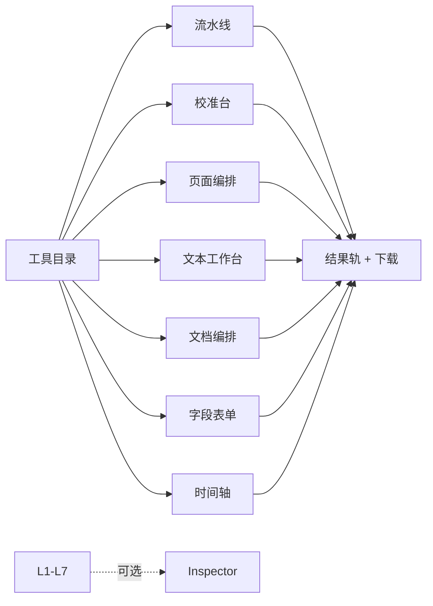

# UI 布局类型体系（完整实现视角）

> 前提：**不做分期、不还技术债**——功能全集均按可上线实现。  
> 布局不按「媒体类型」分，而按**真实使用场景**分。同类场景同一骨架；工具只替换内容控件与检查器。

---

## 类型总览（7 种工作台）

| 代号 | 类型 | 典型心智 | 典型工具 |
|---|---|---|---|
| **L1** | 批量流水线 | 丢进队列 → 定参 → 产出 | 格式转换、压缩、PDF 拼接/拆分、音频转码、清 EXIF |
| **L2** | 视觉校准台 | 参数必须「看得到」才能定 | 水印、旋转、裁剪、图片调色 |
| **L3** | 页面编排台 | 以**页/张**为原子单位排序组合 | PDF 删页/重排/N 合 1、长图拼接、图片转 PDF |
| **L4** | 文本工作台 | 粘贴/编辑 → 变换 → 复制 | JSON、Markdown、Base64、哈希、正则、编码转换 |
| **L5** | 文档编排台 | 长内容 → 分页文档（文字层） | HTML/MD/文本 → PDF、模板填充批量出纸 |
| **L6** | 字段表单台 | 识别/填写**字段**而非盯大图 | 身份证/护照/银行卡 OCR、表单导出 JSON |
| **L7** | 时间轴台 | 按时间线选取区间 | 音频裁剪、视频截取、响度/淡入淡出 |

辅助能力（跨类型，不单独成台）：**Inspector 检查器**（次要预览）、**任务队列条**、**结果轨**、**⌘K**。



---

## 公共骨架（所有类型共用）

```text
┌──────────────────────────────────────────────────────┐
│ 顶栏: Logo · ⌘K · 主题                                │
├──────────┬───────────────────────────────────────────┤
│ 工具目录 │  标题 + 一句说明                            │
│          │  [类型骨架 = 下面 Lx 的主区]                 │
│          │  ────────────────────────────────────────  │
│          │  结果轨（列表 / 进度 / 下载 / ZIP）           │
│          │  ↘ Inspector（可选抽屉，永不默认抢主区）      │
└──────────┴───────────────────────────────────────────┘
```

**不变规则**
1. 主区高度优先给「输入 → 参数 → 主 CTA」  
2. Inspector 默认关；打开时 320–400px 侧栏，不顶掉主 CTA  
3. 结果恒在下方「结果轨」，不弹窗遮工作区  
4. 批量状态机：Empty → Ready → Running → Done/Partial  

---

## L1 批量流水线

**场景**：10～1000 个文件，同一套参数，关心成功与体积。

```text
┌─────────────────────────────────────────────┐
│  [Dropzone 空态 ～30vh]                      │
│  ── 或 ──                                    │
│  文件队列                                    │
│  ☑ 01.png  2.1MB        [预览][移除]         │
│  ☑ 02.jpg  980KB        [预览][移除]         │
│  …                                          │
├─────────────────────────────────────────────┤
│  参数（2 列网格）  质量/格式/边长/输出名…     │
│  [ 开始处理 · 128 个文件 ]     [清空]        │
├─────────────────────────────────────────────┤
│  结果轨  进度 128/128   节省 42%  [ZIP]      │
└─────────────────────────────────────────────┘
```

- **预览**：行内 `预览` 开 Inspector（可选 A/B），**不是**整页画布  
- **失败**：行标红 +「重试该项」  
- **适用**：IMG-CONV / IMG-ZIP / IMG-META / PDF 拼接、拆分 / AU 转码 / IMG→PDF

---

## L2 视觉校准台

**场景**：参数差一点，观感差很多（水印多淡、转多糊、裁到哪）。

```text
┌────────────────────────────┬────────────────┐
│ 主：工作对象列表（细）      │ 参数（常驻）    │
│  · 海报.png                 │ 文字/字号/透明度│
│  · 合同.pdf                 │ 角度/位置九宫格 │
│  ── 当前对象校准 ──         │ [预览开]       │
│  小图占位（高 ≤35vh）       │ [应用到 3 个]  │
│  或点「放大预览」           │                │
├────────────────────────────┴────────────────┤
│ 结果轨                                        │
└─────────────────────────────────────────────┘
```

- **预览仍是次要**：默认小图或 Inspector；点「放大」才浮层  
- A/B 对比滑杆只在 Inspector / 浮层内  
- **适用**：PDF 水印、PDF 旋转、图片水印、裁剪、调色、压缩质量（L1 也能带「校准」入口）

---

## L3 页面编排台

**场景**：按**页/张**操作：排序、删插、拼版。

```text
┌─────────────────────────────────────────────┐
│ 页面网格（主）  [页1][页2][页3][页4] …        │
│  拖拽排序 · 多选 · 删除 · 插入 · 标记范围      │
├─────────────────────────────────────────────┤
│ 操作栏：重排 / N 合 1 / 统一 A4 / 旋转选中    │
│ [ 执行 · 生成 3 个文件 ]                     │
├─────────────────────────────────────────────┤
│ 结果轨                                       │
└─────────────────────────────────────────────┘
```

- 缩略图是**操作对象**（主），不是 Inspector 里的预览  
- Inspector 可显示当前页大图 + 页码信息  
- **适用**：PDF 删页/重排/N 合 1/插空白、长图拼接、图片转 PDF（序）

---

## L4 文本工作台

**场景**：片段数据/代码，粘贴即用，复制即走。

```text
┌──────────────────────────────┬──────────────┐
│ 输入（等宽编辑器）            │ 输出          │
│                              │ 格式化 JSON  │
│                              │ 树视图 ⇄ 文本 │
│                              │ 行号/错误行   │
├──────────────────────────────┴──────────────┤
│ [格式化][压缩][校验][转CSV][Diff][复制][下载] │
└─────────────────────────────────────────────┘
```

- 无文件队列；主 CTA 是变换命令  
- 错误定位内联在输入行旁  
- 树视图可当右侧并列区（内容小，不必塞进 Inspector）  
- **适用**：JSON 系列、Base64、哈希、JWT、正则、颜色、时间戳、二维码

---

## L5 文档编排台

**场景**：写/贴成稿 → 导出**带文字层**的 PDF/文档。

```text
┌──────────────────────────────┬──────────────┐
│ 源：MD / HTML / 文本 / 模板   │ 参数          │
│（编辑器，长文）               │ 纸张/边距     │
│                              │ 主题/字体包   │
│                              │ 页眉页脚/目录 │
│                              │ {{变量}}列表  │
├──────────────────────────────┴──────────────┤
│ [生成 PDF]   校验：文字层 ✓ 可搜索 ✓ 已嵌字体 │
│ 结果轨：页数/体积/下载                        │
└─────────────────────────────────────────────┘
```

- **分页缩略在 Inspector**（次要），不与源码编辑器争主区  
- 验收硬指标：可选中、可 Ctrl+F、中文非豆腐块  
- **适用**：PDFG-01～14、模板批量出纸、MD→HTML

---

## L6 字段表单台

**场景**：证件/票据/表单，要的是**字段值**不是一张大图。

```text
┌─────────────────────────────────────────────┐
│ 类型：[二代身份证 ▾]  [重新识别]              │
│ ┌───────────────────────────────────────┐   │
│ │ 字段表（主）                           │   │
│ │ 姓名  [张三        ] 92% [👁][复制]    │   │
│ │ 号码  [1101…X      ] 98% [👁][复制]    │   │
│ │ 地址  [……          ] 71% [👁][复制]    │   │
│ │ [复制全部][导出 JSON][导出 CSV]        │   │
│ └───────────────────────────────────────┘   │
├─────────────────────────────────────────────┤
│ 批量：证件列表（左） 或 chips                │
│ 结果轨：导出任务                            │
└─────────────────────────────────────────────┘
```

- 图 + 识别框在 **Inspector**；点 👁 闪框定位  
- 低置信字段可编辑；校验规则红字  
- **适用**：ID-01～12、发票/票据（若做）、表单填充

---

## L7 时间轴台

**场景**：在时间线上取段、看波形、做响度。

```text
┌─────────────────────────────────────────────┐
│ 波形/帧条（主）  |====****====|              │
│  拖 In/Out · 缩放 · 吸附                     │
├─────────────────────────────────────────────┤
│ 参数：格式/码率/淡入出/标准化  [试听]         │
│ [导出选段 / 导出全部]                        │
├─────────────────────────────────────────────┤
│ 结果轨                                      │
└─────────────────────────────────────────────┘
```

- 波形是操作面（主）；Inspector 放元数据/频谱（次要）  
- **适用**：AU 裁剪、拼接、变速、V 截取、视频→GIF

---

## 类型 × 功能 映射（节选，完整以 FEATURES.md 为准）

| 功能域 | 主类型 | 备注 |
|---|---|---|
| 图片转换/压缩 | L1 | 带「校准」入口进 L2 预览 |
| 图片裁剪/水印/旋转 | L2 | |
| 图片转 PDF / 长图 | L3 | |
| PDF 拼接/拆分 | L1 | 拆分若做页选则 L3 |
| PDF 删页/重排/N 合 1 | L3 | |
| PDF 水印/旋转 | L2 | |
| PDF 文字层生成 | L5 | |
| OCR 通用文本 | L1 | 任务式 |
| OCR 证件字段 | L6 | |
| JSON/哈希/编码 | L4 | |
| 音频转码 | L1 | |
| 音频裁剪/淡化 | L7 | |
| 视频截取/GIF | L7 | |

---

## 组件层（实现顺序友好）

| 组件 | 服务类型 |
|---|---|
| FileQueue | L1 L2 L3 L7 |
| ParamForm | 全部 |
| PageGrid | L3 |
| CodeEditor / SchemaTree | L4 L5 |
| FieldCardList | L6 |
| TimelineWave | L7 |
| ResultRail | 全部 |
| InspectorDrawer | L1 L2 L3 L5 L6 L7 |
| JobBar（进度/重试/取消） | 全部 |

---

## 与「完整实现」的对齐

- `FEATURES.md` 中条目均为**全量范围**；`P1/P2` 字母作难度参考，不是砍需求  
- 每个功能：实现 + 单元测试 + UI 自动化（见质量门禁）  
- 重型能力直接 Rust→WASM（图像编解码、PDF 瘦身、排版核、OCR 前处理），不保留「以后再说」例外
